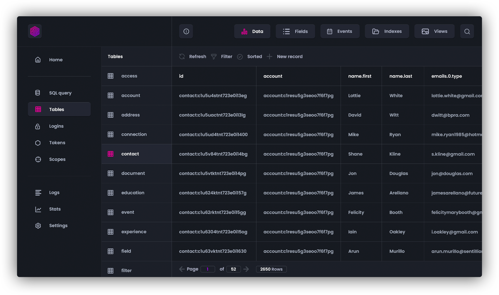

# SurrealDB CI/CD pipeline

Deploy SurrealDB server with CI/CD on Elestio

 
 

# Once deployed ...

There is not ui for this software.

# CURL command

You can use curl command to pass some query. For this, you'll need to pass these credentials:

    user: root
    password: [ADMIN_PASSWORD]

For example, if you want to pass a CREATE query:

    curl --request POST \
        --header "Accept: application/json" \
        --header "NS: test" \
        --header "DB: test" \
        --user "root:[ADMIN_PASSWORD]" \
        --data "CREATE account SET name = 'ACME Inc', created_at = time::now();" \
        https://[CI_CD_DOMAIN]/sql

    curl --request POST \
        --header "Accept: application/json" \
        --header "NS: test" \
        --header "DB: test" \
        --user "root:[ADMIN_PASSWORD]" \
        --data "SELECT * FROM account;" \
        https://[CI_CD_DOMAIN]/sql

Queries are like SQL.
In the header you'll have to pass also NS and DB

- NS is for your name space
- DB is for your database

# Documentation

More informations here: https://surrealdb.com/docs
